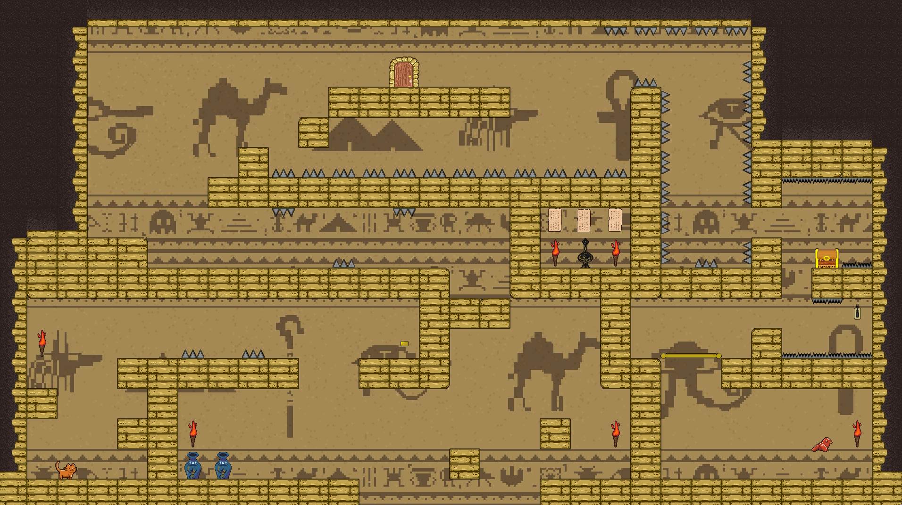

# Whiskers and Wings : Game Project



Whiskers and Wings is a game project I made alongside 4 other students (Tom Bagnara, Alexandre Mans, Léo Guillemart, Jacqueline Huynh) written in Python.

## Running

Make sure you have the latest version of Python installed alongside the Pygame module.
After that, use the following command
```python
python game.py
```

